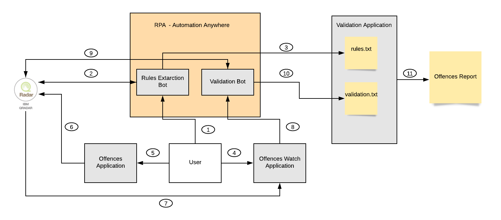
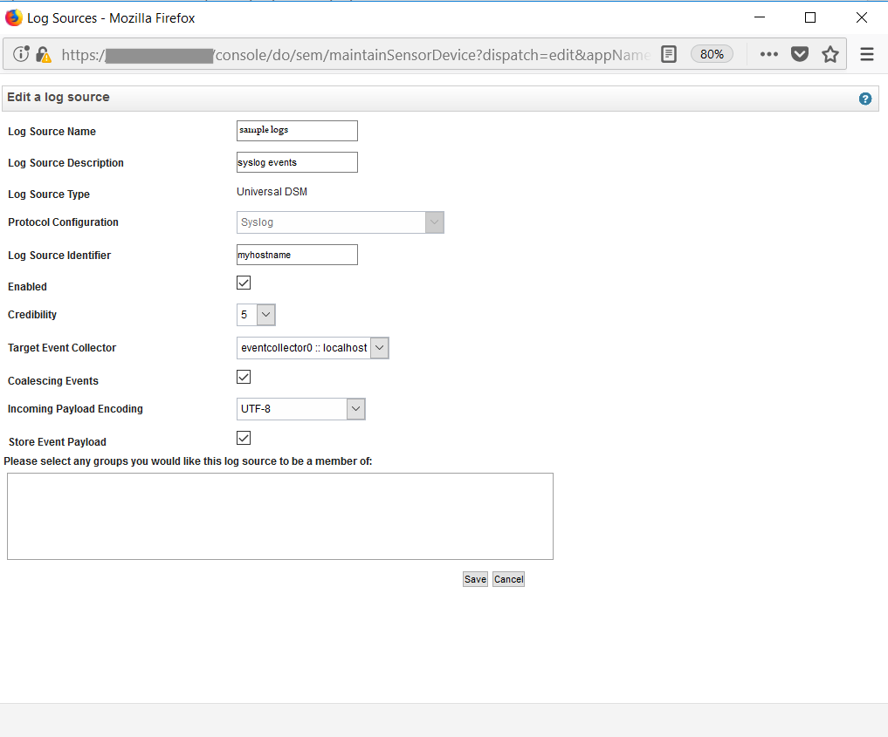
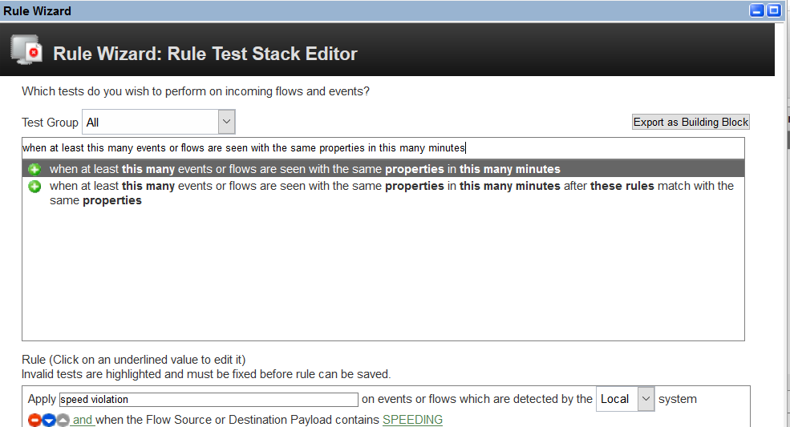

# An integration between RPA and QRadar to automate Security L1 Activities.

An L1 Security person has lots of manual work which can automated significantly to cutdown the effort and increase the efficiency.
One such L1 activity is to check if the offence triggered on QRadar is valid or invalid, by validating it with the rules. 
In this Code Pattern, We have developed a methodology to validate if the offence triggered is valid or invalid.
This pattern would significantly bring down the time that an L1 Security person spends on manually validating the offence with rules.

In this pattern, we will demonstrate the automation with the following usecase. A vehicle has been assigned a speed limit of 100 kmph. If the speed of the vehicle exceeds 100kmph, it is a violation. If speed of the vehicle exceeds 100kmph, twice within 15 min, it will generate an offence on the QRadar. In this code pattern, we will manually send `speed violation events` and generate an offence on QRadar. Once the offence shows up on QRadar, the `Offences Watch Application` will automatically detect the offence and trigger the `Validation Bot`. This `Validation Bot` will run the `Validation Application`, to validate the offence and tells us if the offence triggered is valid or invalid. 

When the reader has completed this Code Pattern, they will understand how to:

* Automate using RPA.
* Extract offences from QRadar using REST API's.
* Automate security L1 Activities.
* Create an `Universal DSM` log source in QRadar.
* Create a rule to detect offense in QRadar.

<!--add an image in this path-->


<!--Optionally, add flow steps based on the architecture diagram-->
## Flow

1. Trigger the `Rules Extraction Bot`.
2. `Rules Extraction Bot` will extract all the necessary rules.
3. `Rules Extraction Bot` will store the rules in `rules.txt`.
4. Run the `Offences Watch Application`, which will look for new offences that are showing up on QRadar.
5. Run the `Offences Application`.
6. `Offences Application` will send `speed violation` events/logs to QRadar.This will inturn generate offence on QRadar.
7. Offence generated on QRadar gets detected by `Offences Watch Application`.
8. `Offences Watch Application` triggers `Validation Bot`.
9. `Validation Bot` extracts required information QRadar.
10. `Validation Bot` will store the extracted information in `validation.txt`, and runs the `Validation Application`.
11. `Validation Application` does the validation and tells if the offence triggered is valid or invalid.

<!--Optionally, update this section when the video is created-->
# Methodology
For better understanding of the methodology, refer to the below diagram


Trigger the `Rules Extraction Bot`, which will extract all the desired rules from `QRadar`.
Now run the `Offence Watch Application`, which will continuously track the offences on `QRadar`. If a new offence is detected on `QRadar`, the `Offence Watch Application` will launch the `Validation Bot`.`Validation Bot` will extract all the necessary information from QRadar and trigger the `Validation Application`. `Validation Application` is responsible for judging the genuineness(valid/invalid) of the offence.

# Watch the Video

[](https://youtu.be/E7g3JXRKQCQ)

## Pre-requisites
* [IBM QRadar SIEM Community Edition](https://developer.ibm.com/qradar/ce/) : Please visit the site for download and installation instructions.
* [Robotic Process Automation - Automation Anywhere](https://www.automationanywhere.com/in/lp/community-edition) : You can download a community edition from this site.
* [Maven](http://maven.apache.org/download.cgi) : Please visit the site for download and installation instructions.

# Steps

Please follow the below to setup and run this code pattern.

1. [Clone the repo](#1-clone-the-repo)
2. [Create rules to detect offences on QRadar](#2-create-rules-to-detect-offences-on-QRadar)
3. [Setup the Rules Extraction Bot](#3-setup-the-rules-extraction-bot)
4. [Setup the Validation Bot](#4-setup-the-validation-bot)
5. [Update the paths in Validation Applications](#5-update-the-paths-in-validation-application)
6. [Build the Applications using Maven](#6-build-the-applications-using-maven)
7. [Run the Applications and analyze the results](#7-run-the-applications-and-analyze-the-results)


### 1. Clone the repo

Clone this [git repo](https://github.com/IBM/integrating-rpa-and-qradar-automate-security-activities.git).
Else, in a terminal, run:

```
$ git clone https://github.com/IBM/integrating-rpa-and-qradar-automate-security-activities.git
```

### 2. Create rules to detect offences on QRadar

**Setup QRadar for detecting speed and location related offences**

* Open the `QRadar Console` from a browser. From the menu, select `Admin` to go to the `Admin` view.

* Scroll down to the `Data sources` section and select `Log Sources`.


* Click on `Add` to add a new log source.


* Configure the log source with the values shown. Click on `Save`.



* In the `Admin` view, click on `Deploy changes` to add the newly configured log source.


* Go to `Log Activity` view.


* Go to the `Rules` view by clicking on `Rules` menu.


* Select `Actions` and then `New Common Rule`.


* The rule wizard opens. Click `Next`.


* Select `Events or flows`. Click `Next`.


* On the `Rule Test Stack Editor`, enter a filter keyword `payload`.


* Select the rule `when the Flow Source or Destination Payload contains this string`. Enter the rule name as `speed violation`.


* Click on `string` and enter the string as `SPEEDING` to creating rule to detect speed offence. This is the string that we will send in the payload. Click `Submit`.


* Select the rule `when atleast this many events or flows are seen with the same propeties in this many minutes`. 



* Click on `this`and enter the value as `2`. Click `Submit`. Click on `properties` and add `Event Name` and `Source IP`. Click `Submit`.


* Click on `many`and enter the value as `15`. Click `Submit`. Click on `minutes` and select `minutes`. Click `Submit`.


* Select the group as `Policy`.

  

* Click `Next`.

* On the `Rule Response` page,
  
  **while creating rule to detect speed offence**, enter the values as shown. Click `Next`.


* Click `Finish` on the `Rule summary` page.

* The newly created rule now, would have been added to the rules list.

You have successfully created rules to detect `speed` related offences. Now you are ready to send events and generate offences on QRadar.

>>NOTE: Please refer to [Monitor device events using QRadar](https://developer.ibm.com/patterns/detect-security-offenses-for-iot-devices-using-qradar/) for more information on rules and offences.

### 3. Setup the Rules Extraction Bot

* Create a new file `rules.txt` and open.

* Open a new browser, preferably Mozilla Firefox or Google Chrome and open your QRadar console login page.

>>NOTE: Make sure both `rules.txt` and `QRadar console login page` are open on task bar.

* Open Automation Anywhere Client.

* Click on New and Select `Screen Recorder`.


* Now follow the following steps,

>> TIP: Wait untill the browser loads.

<b>Step 1 :</b>Open the browser on which you have `QRadar console login page`. Enter your `Username`, `Password` and click on `Submit`.

<b>Step 2 :</b> Click on `Log source` Tab. Click on `Rules` dropdown and select `Rules`. 


<b>Step 3 :</b> In the rules search box,enter speed. Click on speed violation rule. Select the rule and copy using `CLTR + C`.


<b>Step 4 :</b> Open the `rules.txt` which is on task bar and paste the contents copied using `CLTR + V`. Save the file using `CLTR + S`.


<b>Step 5 :</b> Stop the recording and save it as `rules.atmx`.


### 4. Setup the Validation Bot

* Create two new files `validation.txt` and `trigger.txt`.

>>NOTE: Make sure both `validation.txt` and `Log Activity` page of QRadar are open on task bar.

* Open Automation Anywhere Client.

* Click on New and Select `Screen Recorder`.


* Open `Log Activity` page of QRadar. Pause by clicking on the pause button on the right top corner. From the `View` dropdown select `Last 15 Minutes`.


* Click on `Add Filter`. From the `Parameter` dropdown select `Event Name`. Click on browse.


* In the `QID/Name` search box, type in the log source name or the QID of the logs. Click on `Add Filter`.


>>NOTE: In our case the log source name would be <b>Unknown</b>. So type in unknown and press enter. Select your log type from the ones displayed. If not you can type in QID as well, which can be found when you receive a `speed violation` log. If you open the log you will find a QID.

>> Sending a `speed violation` log is taught in the [step 7](#7-run-the-applications-and-analyze-the-results).

* Click on `Current Statistics` dropdown. Select the `Total Results` number and copy using `CLTR + C`. Paste it in `validation.txt` using `CLTR + V` and save it using `CLTR + S`.


* Stop the recording and save it as `validation.atmx`.


* Open the Automation Anywhere Client and follow the below steps to setup a trigger,

<b>Step 1 :</b>Click on `Manage`.

<b>Step 2 :</b>Click on `Trigger`.

<b>Step 3 :</b>Click on `Add`.

<b>Step 4 :</b>In the `Select Task` section, select `validation.atmx` that you have recorded in this section.

<b>Step 5 :</b>In the `Trigger Type` dropdown, select `File`.

<b>Step 6 :</b>In the `File Name` section, select `trigger.txt` that you have created in this section.

<b>Step 7 :</b>In the `Action` dropdown, select `When file is modified`.


### 5. Update the paths in Validation Applications

* The files `rules.txt` and `validation.txt`, that you had create in Step 3 and Step 4 respectively will be used here.
   
**Validation Application**

* Update the paths of `rules.txt` and `validation.txt` in `Validation.java` present at `/Java/validation/src/main/java/com/example/RPAValidation/`, as follows.


### 6. Build the Applications using Maven

**Offence Check Application**

* The Offence Check Application checks for the new offences that are showing up on QRadar.
* The Offence Check Application sources are present in the folder `Java/check` of the repo.
* Check your environment before executing the next step. Make sure, you are able to run `mvn` commands properly.
   > If `mvn` commands fails, please refer to [Pre-requisites](#pre-requisites) to install maven.


To work with the Offence Check Application, perform the following steps.

* Open a command terminal and navigate to the `java/check` directory in the repo. Run the command `mvn install`.

   ```
   cd ../java/check
   mvn clean compile assembly:single
   ```

* A jar file `RoboticProcessAutomation-0.0.1-SNAPSHOT-jar-with-dependencies.jar` is built and can be found under the `target` folder. This jar can be renamed to `RPA.jar` to keep the name short. 

   ```
   cd target
   cp RoboticProcessAutomation-0.0.1-SNAPSHOT-jar-with-dependencies.jar RPA.jar
   ```
  
**Offences Application**

* The Offences Application is used to send events/logs to QRadar.
* The Offences Application sources are present in the folder `Java/offences` of the repo.
* Check your environment before executing the next step. Make sure, you are able to run `mvn` commands properly.
   > If `mvn` commands fails, please refer to [Pre-requisites](#pre-requisites) to install maven.


To work with the Offences Application, perform the following steps.

* Open a command terminal and navigate to the `java/offences` directory in the repo. Run the command `mvn install`.

   ```
   cd ../java/offences
   mvn clean compile assembly:single
   ```

* A jar file `offence-0.0.1-SNAPSHOT-jar-with-dependencies.jar` is built and can be found under the `target` folder. This jar can be renamed to `offences.jar` to keep the name short. 

   ```
   cd target
   cp  offence-0.0.1-SNAPSHOT-jar-with-dependencies.jar offences.jar
   ```
   
**Validation Application**

* The Validation Application validates the genuineness( valid/invalid ) of the offence.
* The Validation Application sources are present in the folder `java/validation` of the repo.
* Check your environment before executing the next step. Make sure, you are able to run `mvn` commands properly.
   > If `mvn` commands fails, please refer to [Pre-requisites](#pre-requisites) to install maven.


To work with the Validation Application, perform the following steps.

* Open a command terminal and navigate to the `java/validation` directory in the repo. Run the command `mvn install`.

   ```
   cd ../java/validation
   mvn clean compile assembly:single
   ```

* A jar file `RPAValidation-0.0.1-SNAPSHOT-jar-with-dependencies.jar` is built and can be found under the `target` folder. This jar can be renamed to `RPAV.jar` to keep the name short. 

   ```
   cd target
   cp  RPAValidation-0.0.1-SNAPSHOT-jar-with-dependencies.jar RPAV.jar
   ```
   
 ### 7. Run the Applications and analyze the results
 
 #### Step 1: Trigger the Rules Extraction Bot.
 
 * Run the Rules extraction bot that you have trained.
 
  
  
 #### Step 2: Run the Offence Watch Application.
 
 * Execute the following command from the target directory(directory where the RPA.jar file is located)
  ```
  java -cp RPA.jar app.example.RoboticProcessAutomation.App 
  ```
   Fill in your QRadar Hostname/IP Address,Username and Password,
  
   ***Output:***

    >>>Enter your QRadar username:
    admin
    >>>Enter your QRadar password:
    xxxxxxxxx
    >>>Enter your QRadar hostname/IP Address:
    192.168.xxx.xxx 
  
  * This application now looks for new offences on QRadar.
  
 >> NOTE: Don't abort this program. This is a dynamic application which continously tracks for offences on QRadar. If an offence is found, this application triggers a validation bot to check if the offence triggered is valid or invalid.
      
  * In the next step we shall create an offence on QRadar.
 
 #### Step 3: Send offences to QRadar.
 
 * First let us create a speed related offence on QRadar,by execute the following command <b>twice</b>. from the target directory(directory where the offences.jar file is located).
 
   ```
   java -cp offences.jar app.example.offence.App
   ```
   Fill in your QRadar Hostname/IP Address and enter to sent speed related event,
  
   ***Output:***

   ``` 
      >>>Enter the QRadar Hostname/IP Address
      192.168.xxx.xxx
      Sending speed violation
      Event sent successfully
   ```
      >>NOTE: Run the above command twice, because we need two speed violations to create an offence.

      
 #### Step 4: Analyze the results.
 
 The above detected offence is valid, since it was triggered according to the rule. 
 
 
 
 If it is not triggered according to the rule, we would get `offence is invalid`.
 
 #### Furthur Enhancements.
 
 we can furthur enhance this pattern to generate a detailed offence report as follows,
 
 

<!--Optionally, include any troubleshooting tips (driver issues, etc)-->

# Troubleshooting
If you encounter any certificate related issues, refer to [TROUBLESHOOTING.md](https://github.com/IBM/integrating-rpa-and-qradar-automate-security-activities/blob/master/TROUBLESHOOTING.md)

<!-- keep this -->
## License

[Apache 2.0](LICENSE)
